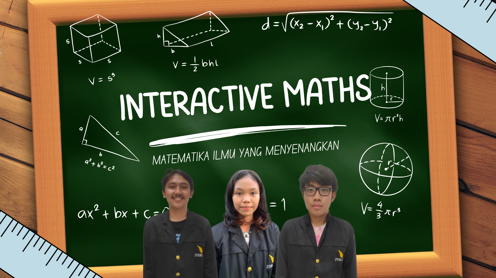

<p align="center">
  
</p>

<h1 align="center">🧮 Interactive Maths 🧮</h1>

<p align="center">
  <a href="https://github.com/RamonRiping-122140078/uas_tekmul_numerouno">
    
  </a>
  <a href="#">
    
  </a>
</p>

## **🧮Daftar Isi**
[Deskripsi Proyek](#deskripsi-proyek)

[Anggota Tim](#anggota-tim)

[Teknologi aplikasi](#teknologi-applikasi)

[Instruksi Instalasi ](#instruksi-instalasi)

[Instruksi & Aturan Permaianan ](#instruksi-&-aturan-permainan)

[Logbook Mingguan](#logbook-mingguan)

[Laporan](#laporan)

[Demo Program](#demo-program)

## **🧮Deskripsi Proyek**
Interactive Maths adalah aplikasi interaktif yang menggabungkan pembelajaran matematika dasar dengan teknologi deteksi gestur tangan dan audio. Pengguna akan diberikan **lima soal acak** tentang penjumlahan, pengurangan, perkalian, atau pembagian secara bergantian. Jawaban diberikan dengan **menunjukkan jumlah jari tangan** sesuai hasil perhitungan.  

Sistem akan:  
1. Mendeteksi jumlah jari dari gestur tangan pengguna menggunakan kamera.  
2. Mengonversi gestur ke angka melalui audio (misal: "Lima").  
3. Memeriksa kebenaran jawaban dan memberikan umpan balik suara:  
   - "Anda Benar!" jika jawaban tepat.  
   - "Anda Salah, jika jawaban salah.  

Cocok untuk anak-anak dan siapa pun yang ingin belajar matematika dengan cara menyenangkan!

## **🧮Anggota Tim**
| [<br /><sub><b>Ramon Riping</b></sub>](https://github.com/RamonR122140078)<br />122140078 <br /> | [<br /><sub><b>Desty Ananta Purba</b></sub>](https://github.com/destyananta)<br />122140076 <br /> | [<br /><sub><b>Muhammad Fauzan As Shabierin</b></sub>](https://github.com/Mfauzanasshabierin)<br />122140074 <br /> |
|--|--|--|

## **🧮Teknologi Aplikasi**
<div align="left">

| Name | Description |
| :---: | :---: |
| **Python** | Bahasa pemrograman utama yang digunakan dalam pengembangan aplikasi. |
| **MediaPipe** | Digunakan untuk melacak jumlah jari tangan secara real-time dengan akurasi tinggi. |
| **CV2 (OpenCV)** | Menangkap video dari webcam dan memprosesnya untuk digunakan oleh MediaPipe. |
| **NumPy** | Digunakan untuk pengolahan data numerik seperti koordinat jari dan logika evaluasi jawaban. |
| **Pygame** | Digunakan untuk membuat antarmuka grafis interaktif seperti tampilan soal matematika, teks jawaban, dan umpan balik audio/visual. |

</div>

## **🧮Instruksi Instalasi**
1. **Clone repositori**:  
```bash
git clone https://github.com/RamonR122140078/uas_tekmul_numerouno.git
cd uas-tekmul-numerouno
```

2. **Buat virtual environment menggunakan uv**
```bash
uv venv --python=python3.10
```
Ini akan membuat folder .venv/ di dalam repo.

3. Aktifkan virtual environment
- Di Linux/macOS:
```bash
source .venv/bin/activate
```
- Di Windows:
```bash
.venv\Scripts\activate
```

4. **Instal semua dependensi yang diperlukan**:
```bash
uv pip install -U -r requirements.txt
```

5. **Jalankan program**:
```bash
cd project
python main.py
```

## 🧮Instruksi & Aturan Permainan

### Cara Bermain
1. **Jalankan program** dan pastikan webcam aktif.
2. Pada menu utama, arahkan tangan ke tombol "Start" untuk memulai permainan.
3. Setelah permainan dimulai, wajah Anda akan terdeteksi dan soal matematika akan muncul di atas kepala Anda.
4. Jawab soal dengan menunjukkan jumlah jari tangan sesuai hasil perhitungan ke kamera.
   - Anda bisa menggunakan satu atau dua tangan untuk menunjukkan angka 0-10.
5. Sistem akan otomatis mendeteksi jumlah jari dan menampilkan jawaban Anda di layar.
6. Anda memiliki waktu **7 detik** untuk setiap soal.
7. Setelah waktu habis, sistem akan memberi tahu apakah jawaban Anda benar atau salah, baik secara visual maupun suara.
8. Permainan terdiri dari **5 soal acak**.
9. Setelah semua soal selesai, skor akhir akan ditampilkan.
10. Tekan tombol "Try Again" dengan tangan untuk mengulang permainan, atau tekan tombol `Q` pada keyboard untuk keluar.

### Aturan Permainan
- Jawaban hanya diterima dalam bentuk jumlah jari yang terdeteksi kamera (0-10).
- Setiap jawaban benar mendapat **20 poin**.
- Tidak ada penambahan dan pengurangan nilai untuk jawaban salah.
- Jika waktu (6 detik) habis dan belum ada jawaban, dianggap salah.
- Skor maksimal adalah **100 poin**.
- Permainan dapat diulang tanpa batas dengan menekan tombol "Try Again".

## 🖐 Panduan Posisi Jari Berdasarkan Angka
Berikut adalah gambar-gambar referensi posisi tangan yang benar agar sistem dapat mengenali angka dari 0 hingga 10 dengan akurat:
<table align="center">
  <tr>
    <td align="center"><br><b>Angka 0</b></td>
    <td align="center"><br><b>Angka 1</b></td>
    <td align="center"><br><b>Angka 2</b></td>
    <td align="center"><br><b>Angka 3</b></td>
    <td align="center"><br><b>Angka 4</b></td>
    <td align="center"><br><b>Angka 5</b></td>
  </tr>
  <tr>
    <td align="center"><br><b>Angka 6</b></td>
    <td align="center"><br><b>Angka 7</b></td>
    <td align="center"><br><b>Angka 8</b></td>
    <td align="center"><br><b>Angka 9</b></td>
    <td align="center"><br><b>Angka 10</b></td>
    <td></td>
  </tr>
</table>

### 📌 Catatan:
- Pastikan jari terlihat jelas di depan kamera agar sistem dapat mengenali angka dengan akurat.
- Saat bermain, arahkan *telapak tangan menghadap kamera*, bukan bagian punggung tangan.
- Hindari gerakan cepat atau posisi tangan terlalu miring agar sistem tidak kesulitan mengenali jumlah jari.

## **🧮Logbook Mingguan**
| Minggu       | Topik                          | Progress                                                                 |
|--------------|--------------------------------|--------------------------------------------------------------------------|
| **Minggu 1** | Setup Proyek & Ide             | - Menentukan konsep aplikasi<br>- Membuat repositori GitHub             |
| **Minggu 2** | Mastering Github dan Inisiasi Fitur | - Membuat branch masing - masing<br>- Membuat desain dan asset proyek<br>- Membuat code untuk UI Menu<br>- Menerapkan MediaPipe Hand Landmarks |
| **Minggu 3** | Pembuatan Menu dan Permainan   | - Menggabungkan Menu dan Hand Landmarks<br>- Mengatur Waktu Menjawab Per Pertanyaan |
| **Minggu 4** | Finalisasi                     | - Fiksasi tampilan akhir<br>- Penambahan backsound<br>- Pembuatan laporan<br>- Pembuatan video |


## **🧮Laporan**
Laporan akhir proyek dapat diakses melalui:  
[Laporan](https://www.overleaf.com/read/krbpfdtybsws#f35f54)
- Koordinator Laporan : Desty Ananta Purba

## **🧮Demo Program**
Berikut adalah video demonstrasi dari program Interactive Maths:

[](https://youtu.be/bLSM3OD-eHI)
